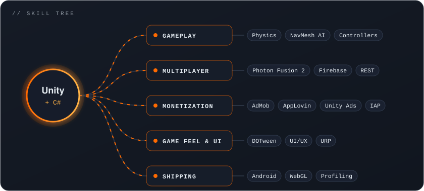
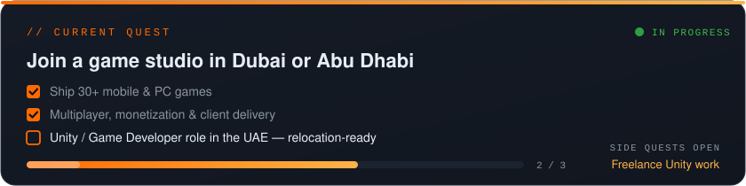

  
  
  

  

  <b>Recruiters & clients —</b>
  <a href="https://www.linkedin.com/in/shahzadhussain49">LinkedIn</a> ·
  <a href="mailto:shahzadhussain74303@gmail.com">shahzadhussain74303@gmail.com</a> ·
  <a href="https://buildbyshahzad.netlify.app/">buildbyshahzad.netlify.app</a>

